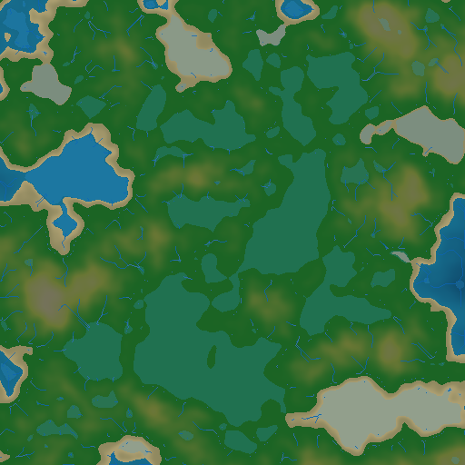
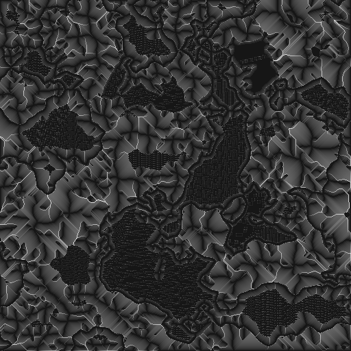
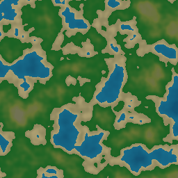

# Perlin Noise Map (Python + Streamlit)

An interactive lab for understanding Perlin noise and applying it to practical world generation.

This repository is intentionally focused on *every aspect of Perlin noise*: the math, the implementation details, and the visual intuition behind each step (from gradients and dot-products to fade curves, interpolation, octaves, and 3D terrain).

Project goals and roadmap live in `GOALS.md`.

## Supported Features

### Learn (Step-By-Step)

- Single-cell inspector: gradients, dot products, fade curve, interpolation, and final value.
- Scanline animator and intermediate plots for intuition building.

### Explore (2D + 3D)

- 2D map explorer: seed, scale, octaves, lacunarity, persistence.
- Variants: fBm, turbulence, ridged, domain warp.
- Tileable/seamless mode.
- 3D heightmap (interactive).
- Tooling: presets, snapshots, A/B diff, cross-section tool.
- Exports: grayscale PNG, `.npy`, 3D OBJ mesh, shareable URL state (query params).

### Practical (Terrain Worldgen)

- Terrain map visualization with biomes: water/shore/land/mountains + slope-aware snow.
- Lighting: hillshade with azimuth/altitude controls.
- Hydrology: D8 flow direction + flow accumulation, rivers, river carving, depression-filled lakes.
- Weathering: thermal erosion + simple hydraulic erosion.
- Weathering animation: playback + scrubber for thermal/hydraulic and combined sequences.
- Endless navigation: chunked generation, WASD/buttons movement, teleport, “go to chunk”.
- Chunk cache: in-session LRU caching with hit/miss counters.
- Optional “Fast” backend: float32 storage for quicker interaction.
- Exports:
  - Terrain preview PNG
  - height/biome/rivers `.npy`
  - tileset zip (`z/x/y.png`)
  - chunk-aligned stitched export (k x k chunks) + metadata

## Screenshots

Practical terrain map:



Flow accumulation (debug layer):



Thermal erosion animation:



## Notes

- Default viewport is `1024x1024`.
- If the Practical weathering animation feels slow, reduce the animation resolution.

## Quickstart

1. Create and activate a virtual environment

```bash
python3 -m venv .venv
source .venv/bin/activate
```

2. Install dependencies

```bash
python3 -m pip install -U pip
python3 -m pip install -r requirements.txt
```

3. Run the Streamlit app

```bash
streamlit run streamlit_app.py
```

4. Run tests

```bash
python3 -m pytest
```

Optional: generate README assets (screenshots/GIF):

```bash
source .venv/bin/activate
python3 scripts/generate_readme_assets.py
```

Optional: run benchmarks:

```bash
source .venv/bin/activate
python3 scripts/benchmark.py
```

## Repository Layout

```text
.
|- streamlit_app.py          # Streamlit UI (Learn / Explore / Practical)
|- perlin/                   # Core noise implementations (pure + testable)
|- worldgen/                 # Terrain/hydrology/erosion utilities (pure)
|- viz/                      # Plotting + export helpers
|- st_components/            # Custom Streamlit components (live sliders, hotkeys)
|- ui/                       # CSS/theme
|- tests/                    # Pytest unit tests
|- scripts/                  # Benchmarks + README asset generation
|- assets/                   # README images/GIFs
`- GOALS.md
```

## Guiding Principles

- Deterministic by default (seeded; reproducible outputs).
- "Show the work" visuals: every intermediate stage should be inspectable.
- Implementations stay readable first, then get optimized (vectorization/numba) with profiling.
- Prefer pure functions for noise generation/worldgen; keep Streamlit as the UI layer.

## References

- Ken Perlin, *Improving Noise* (2002).
- Ken Perlin, *An Image Synthesizer* (1985).
